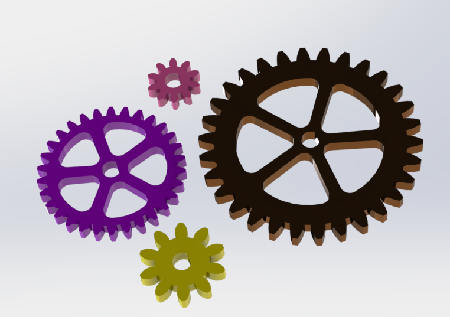

# Advanced CAD
   My Advanced CAD Assignments.
   These are my Advanced CAD Assignments from Engineering 3
 
 
 
 
 
 
 
 
 
 ## Gears
 
 ### Description
In this assignment, we had to create 4 different gears using different configurations. There were 4 variants (configurations). We used equations and configuartions. We also used global variables to store a quanity (a number) that we could call whenever we needed that specific distance. ( Distance = 5mm;  We can write "Distance" instead of having to remember 5mm)
 
 ### Lessons Learned
The most important lesson that I learned was configuartions. They make creating derived parts from one initial part much easier. I learned that if you are using equations for your configurations, to make sure that you select the correct tab. If you want a change to only apply to one configuration, MAKE SURE you click "For Only this Configuration" or you will risk changing all your other progress on other configurations. 
  
 ### Images and Diagrams
 Rendering of Gears
 
 
 
 
 
 
 
 
 
 
 
  ## Gearbox
 
 ### Description
In this assignment, we assembled the gears that we made in a previous assignment to create a gearbox that housed them all. We also created a knob that when spun, will spin all the gears.
 
 ### Lessons Learned
The biggest lesson that I learned from this Gearbox assignment was how to use gear mates. You select the axis of rotation for each gear, and then you specify the amount of teeth. Once completed, the gear mate works very well and gives a good view of how the gears will interact in real life. Another new trick that we learned was the revolved cut feature. This let us cute a screw hole into the knob. It is rather straight forward, but make sure that you pay attention to the preview before revolving. 
  
 ### Images and Diagrams

Rendering of Gearbox

 

 ## Motion Study
 
 ### Description
In this assignment, we had to create a platform and mechanuism that would mimic reality. When a servo rotated, a plate would then be raised, and once the servo rotated far enough, the platform would fall back down due to gravity. 

 
 ### Lessons Learned
 In Motion study, I learned how to use the Motion study module in solidworks. Creating the parts and mating them was relatively easy and by now, completely completable without help. The more difficult part was the motion study itself. There were some awkward stumbles that we took. For instance, we overlooked the direction that the servo would be rotating. As a result, the servo rotated the wrong direction later on. Make sure that you don't overlook any small details similar to this in the future.

  
 ### Images and Diagrams
Rendering of Motion Study

 

 

 ## Stress Analysis
 
 ### Description
In this assignment, we had to create a servo horn and do a proper stress analysis on the horn. The stress analysis would tell us where forces are lower and higher, as well as weak and strong points.
 
 ### Lessons Learned
 
 A lesson that I leanred from the Stress Analysis was that fillets make parts stronger. If you have a 90 degree angle, adding a fillet will likely increase the strength of the part. Also, besides just learning how to set up the Stress Analysis, there is a thing to remember, similar to the Motion Study. Pay attention to what boxes you have checked, as well as where your forces are coming from. This can lead to an issue where you have incorrect results from a result of incorrect set up. 

 ### Images and Diagrams

   
